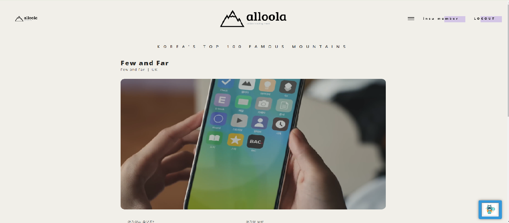

## 프로젝트 페이지로 이동 = > &nbsp;&nbsp;&nbsp;&nbsp; [[Project CODELAP_ALLOOLA]](http://3.143.252.195:3001/mainPage)  
&nbsp;&nbsp;&nbsp;&nbsp; **[id:user1 / password:password1]**

# codelap_alloola
## 목차

### -팀원소개
    
 |  이름  | 백엔드(주요 프레임워크) | 개발환경 | DataBase | 프론트엔드 
|--------|---------------------|-------------------------------|-----------------------------|-----------------------------|
| 김정승 |    nodejs, Nginx, ejs    |    IntelliJ IDEA , vim      | oracle 11g | HTML, javascript, css, jquery|
| 노가현 |    nodejs, Nginx, ejs    |    IntelliJ IDEA , vim      | oracle 11g | HTML, javascript, css, jquery|
| 김인수 |    nodejs, Nginx, ejs    |    IntelliJ IDEA , vim      | oracle 11g | HTML, javascript, css, jquery|
| 배은지 |    nodejs, Nginx, ejs    |    IntelliJ IDEA , vim      | oracle 11g | HTML, javascript, css, jquery|

[AWS 실행환경](http://3.143.252.195:3001/mainPage)

---
    
### 프로젝트개요
+ 기간 : 2024.02.08(목) ~ 2024.03.05(화)
+ 주제 : 대한민국 100대 명산을 소개, 유저들의 참여를 독려하는 웹서비스를 제공 

---
### 담당업무

* 김정승 -  
    + 데이터베이스 구성 및 제작 / 공공데이터 입력
    + 데이터베이스를 활용한 정보제공 페이지 제작 및 정렬기능 구현
    + 유저 참여를 위한 CRUD가 가능한 게시판 구현
    + 페이지 템플릿 구현
    + chatbot 구현
    + 회원가입, 로그인 등 페이지 기본 기능 구현
  
* 노가현 -  
    + 데이터 조사 및 웹 서비스 기획
    + 데이터베이스 구성 및 제작 / 공공데이터 입력
    + nodeJS와 html을 활용한 CRUD 기능 구현

* 김인수 - 
    + 쇼핑몰 게시판 제작 담당
    + 데이터베이스 구성 및 제작 / 공공데이터 입력

* 배은지 - 
  +  자료조사 및 웹서비스 기획
  +  유저들이 자유롭게 사용하는 자율 게시판 구현
  +  데이터베이스 구성 및 제작 / 공공데이터 입력
---
### 주요기능 
* 김정승 -
  + 공공 API 및 지도 API, Weather API 등을 활용한 정보제공 기능
  + 이미지와 comment 를 남길 수 있는 게시판 기능
  + 검색 및 페이지 안내를 하는 chatbot 기능
  + 페이지 이동없이 javascript를 통한 DB 와의 통신기능

* 노가현 -  
  + 게시판 페이징 처리 및 검색 기능
  + 완등후기 게시판(alloola board) CRUD
  + 게시판 내 좋아요 기능
  + logout/loginFail 기능
  + jQuery와 chart.js를 이용한 map 페이지 내의 차트 작성         

* 김인수 -  
  +  customshop,customshop_comments 테이블생성
  +  customshop 기능 구현
  +  게시글 작성
  +  댓글, 찜, 조회수 작업

* 배은지 -  
  +  oracle be table 생성
  +  게시판 페이징 처리 및 검색 기능
  +  자유게시판 기능 구현  CRUD
  +  댓글, 대댓글  CRUD
---

### -향후과제
    + 프로젝트 과제

    + 조원별 개인 과제
    
     - 김정승 -  
         Main Page 컨텐츠 추가 및 추가 기능 구현
         chatbot 기능 추가 
         산 정보 제공 페이지 정리
     - 노가현 -     
         DB의 mount_code를 활용한 MOUNT 100 페이지 연동
         CRUD UI 개선
         실데이터를 반영한 chart 개발
         게시판의 '좋아요'와 조회수 중복막기
 
     - 김인수 - 
         미흡한 디자인, 기술들을 보안하고 결제가 가능한 페이지로 구축하는 것이 목표입니다.

     - 배은지 - 
         CRUD UI 개선
         게시판 좋아요 기능
         대댓글을 연속으로 누르면 계속해서 댓글창 수정

